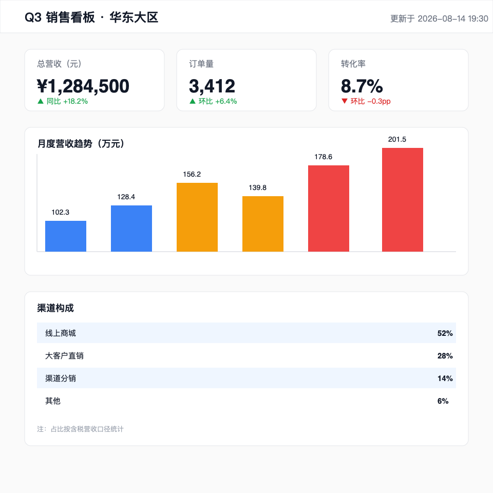

# kimi-eyes 👀

给你的 DSH（DeepSeek Harness）主 agent 装上「眼睛」：注册一个 `kimi_vision` 工具，把图片交给 **Kimi K3 视觉模型**识别，返回文本描述。

主模型路由不支持图片输入（比如 DeepSeek 文本模型）时，agent 照样能看懂截图、图表、照片、扫描件，还能针对图片追问。

## 效果

把这张仪表盘截图交给 agent：



`kimi_vision` 返回（原样节选）：

> 图为「Q3销售看板·华东大区」，更新于 2026-08-14 19:30。总营收 ¥1,284,500，同比 +18.2%；订单量 3,412，环比 +6.4%；转化率 8.7%，环比 -0.3pp。月度营收（万元）为 102.3、128.4、156.2、139.8、178.6、201.5，整体走高但中途回落。渠道构成：线上商城 52%、大客户直销 28%、渠道分销 14%、其他 6%（含税口径）。结论：营收与订单增长强劲，线上商城占比过半，转化率略降需关注。

## 为什么需要它

DSH 内置的 `read_image` 工具要求**当前模型路由本身支持图片输入**（图片进主模型上下文）。如果你的主模型是纯文本模型，`read_image` 会直接拒绝。

`kimi_vision` 是模型无关的兜底：图片永远发给 Kimi 的视觉模型，主模型只消费文字结果，识别质量不依赖主模型。

```
用户：「看看这张架构图，结合上面的讨论…」
      │
      ▼
agent 调用 kimi_vision(file_path, question)
      │  base64 图片 + 问题
      ▼
Kimi K3（Anthropic 协议 /v1/messages）──▶ 文本描述
      │
      ▼
描述回到对话，agent 结合上下文继续推理
```

## 安装

前置：能访问 Kimi 的 Anthropic 协议 API（`https://api.kimi.com/coding`）。密钥读取顺序：

1. 环境变量 `KIMI_API_KEY`
2. 环境变量 `ANTHROPIC_AUTH_TOKEN`
3. `~/.codex/config.toml` 里的 `ANTHROPIC_AUTH_TOKEN`

```bash
# 1. 克隆并把包链接进 profile 的 node_modules
git clone <repo-url> kimi-eyes
ln -sfn "$(pwd)/kimi-eyes" ~/.dsh/profiles/web/node_modules/kimi-eyes
```

```yaml
# 2. 在 ~/.dsh/profiles/web/cordis.patch.yml 追加（保存即热重载，刷新浏览器）
- insert:
    - id: kimi-eyes
      name: './node_modules/kimi-eyes/lib/entry.js?v=1'
      config:
        model: kimi-k3
```

## 用法

不用记工具名，正常说话就行：

- 「看看这张图」→ agent 自己会调用 `kimi_vision`，默认详细描述图片。
- 「`assets/demo.png` 里的转化率是多少？环比变化原因可能是什么？」→ 针对图片提问。
- 「读一下这张扫描件里的所有文字」→ OCR。

支持 PNG / JPEG / WebP / GIF；路径可用相对路径（按会话工作目录解析）或 `~` 开头。单张上限 20MB（`config.maxImageBytes` 可调）。

## 热更新协议

DSH 的 profile loader 只在行 `name` 变化时才重新 import，且裸 import 走 ESM 缓存。本项目因此约定：

| 改动 | 操作 |
| --- | --- |
| 只改行 config（如 `model`） | 直接保存 |
| 改 `lib/impl.js` / `lib/entry.js` | 把行名末尾 `?v=N` **递增**再保存 |

`entry.js` 会把查询参数透传给 `impl.js`，实现"改代码 → 存 patch → 热生效"，全程不用重启 DSH。

## 踩坑记录（本项目的真正干货）

1. **工具参数必须是编译后的 JSON Schema。** 直接给 `ctx.tools.register` 传逐字段的参数对象、跳过 `defineTool` 编译，会让 function schema 顶层缺 `type: "object"`，DeepSeek 网关直接拒绝整轮请求：`Invalid schema for function ... got 'type: null'`。教训：schema 一律走应用自带的 `@deepseek-ai/dsh-tools` 的 `defineTool` 编译。
2. **热重载 ≠ 热更新代码。** loader 只在行 name 变化时重新 import，且 ESM 按 URL 缓存——改完代码保存 patch，跑的还是旧模块。这就是 `?v=N` 协议的来历。
3. **符号链接包解析不到宿主依赖。** 链接进 profile node_modules 的包，ESM 从真实路径向上解析依赖，找不到宿主（`~/.npm/_npx/<版本>/node_modules`）里的 `@deepseek-ai/*`。本项目按目录 mtime 动态发现最新部署里的 `dsh-tools`，harness 升级后自动跟随；发现失败则回退到本地等价编译（与 `defineTool` 输出已逐字节比对）。

## 目录结构

```
lib/entry.js   稳定薄入口：查询参数缓存破坏，转发 impl.js
lib/impl.js    实现：工具定义、路径解析、Kimi API 调用、defineTool 动态发现
lib/index.js   包根转发
assets/demo.png 演示用仪表盘截图
```

## 相关项目

- [dsh-usage-meter](https://github.com/ 等你填)：同一「profile 组合层挂本地插件」模式的例子（DeepSeek 余额 + 会话用量读出）。

## License

MIT
